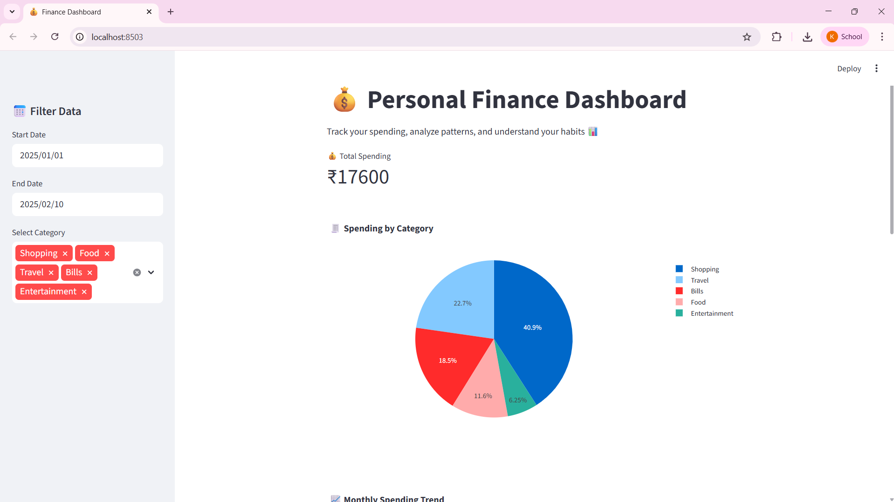

# personal-finance-dashboard
A data analytics and machine learning project that analyzes personal spending patterns and visualizes insights using Streamlit.

# 💰 Personal Finance Dashboard

## 📌 Project Overview
This project analyzes personal spending data and visualizes insights using a dashboard.

## 🚀 Features
- 📊 Spending by category (Pie Chart)
- 📈 Monthly spending trends
- 📅 Date filtering
- 💰 Total spending calculation
- 🧠 Insights on spending habits
- 🤖 Clustering using KMeans

## 🛠️ Tech Stack
- Python
- Pandas
- Scikit-learn
- Streamlit
- Plotly

## ▶️ How to Run
```bash
pip install -r requirements.txt
streamlit run app.py

## 📸 Dashboard Preview


