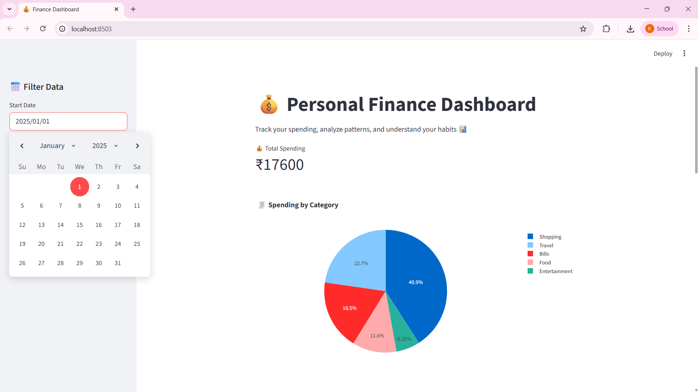
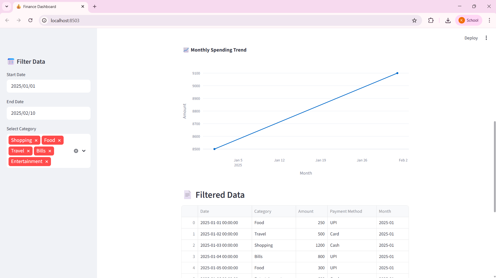
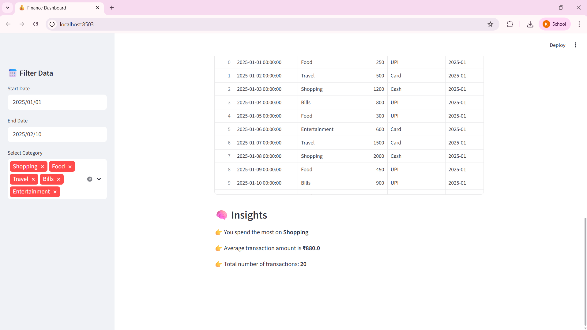
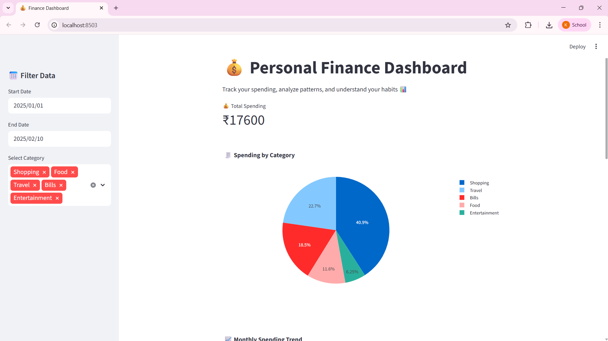

# Personal Finance Dashboard

A Python + Streamlit dashboard that analyzes personal spending patterns and visualizes insights.

## 📊 Overview
This project takes raw personal transaction data and turns it into an interactive dashboard showing spending trends by category, month, and merchant — helping identify saving opportunities.

## 🧱 Approach
1. **Data Cleaning** — Parsed and categorized raw transaction data (bank statements/CSV exports) using Python (pandas).
2. **Analysis** — Computed spending trends across categories, months, and recurring expenses.
3. **Visualization** — Built an interactive Streamlit dashboard with filters for date range and category.

## 🖼️ Live Demo
🔗 **[View the live app](https://personal-finance-dashboard-rfqvg9fammxb6kpek43lzh.streamlit.app/)**

## 📸 Dashboard Preview

### 📊 Dashboard View 1


### 📊 Dashboard View 2


### 📊 Dashboard View 3


### 📊 Dashboard View 4



## 🛠️ Tech Stack
Python · pandas · Streamlit · Plotly/Matplotlib

## 📁 Structure
```
personal-finance-dashboard/
├── data/               # sample/anonymized transaction data
├── app.py              # Streamlit app
├── analysis/          # exploratory analysis
├── images/             # dashboard screenshots
└── README.md
```

## 🚀 How to Run
```bash
git clone https://github.com/sarikakothapalli/personal-finance-dashboard.git
cd personal-finance-dashboard
pip install -r requirements.txt
streamlit run app.py
```

---
